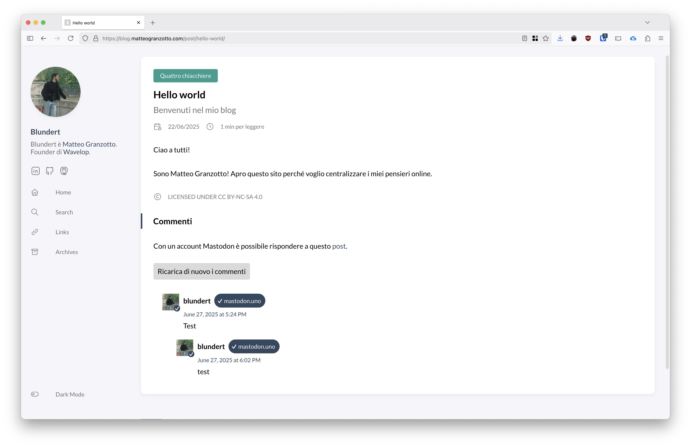

Sicuramente nessuno commenterà in questo blog però continuando a impostare il tutto con i principi dell'IndieWeb ho pensato di impostare i commenti con Mastodon. 

[Mastodon](https://joinmastodon.org/it) è un social network decentralizzato, opensource e non governato dalle corporate.

Ho seguito la seguente guida per configurare i commenti: https://carlschwan.eu/2020/12/29/adding-comments-to-your-static-blog-with-mastodon/

Ora mi basta condivide il post su Mastodon e poi impostare nel frontmatter del post il codice identificativo et voilà:

Il post è il seguente: https://blog.matteogranzotto.com/post/hello-world/

